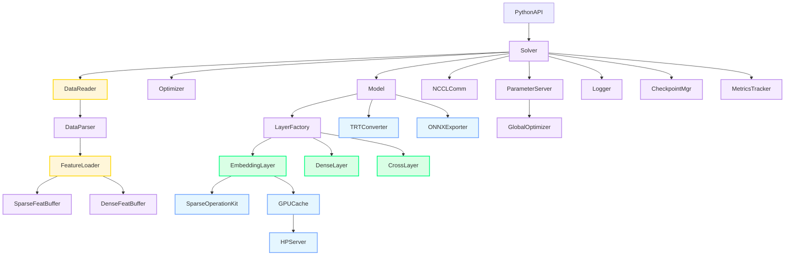
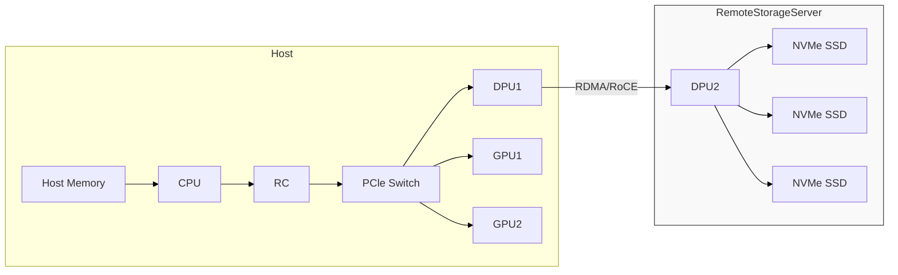

微信公众号 Ostring24

纵观现在大语言模型和传统AI的落地前景，其实目前还是主要以license 账号的方式来收费，这种方式有一个可见天花板：用户数量。今天早上看到微软Copilot 新签了一个100万licence 的企业大客户，大家都猜测只可能是少数几家大互联网公司，比如亚马逊，以license 收费，要做到边际成本降低很难，同时扩张效应也较弱。

但今天要聊的是传统互联网（互联网已经可以叫传统行业了，sign...）营收主力：搜广推，搜广推业务从搜索时代，到信息流，到电商，其实一直在做演进，其依赖的主力模型也从传统的CV/NLP 到目前的大语言模型和MMOE 等多专家模型，其目前仍然是AI 这项技术盈利的主要途径，而且是营收大户。

从我个人的视角去看，今天只想从技术的角度聊聊在大语言模型时代，这项业务的一些拆解，也试着去看从顶层业务对底层技术发展提出的需求，大家一起交流，欢迎留言。

这篇文章试图回答几个问题：

- 目前搜广推系统有哪些？该如何选择；
- 搜广推系统对芯片基本面的要求；
- 搜广推业务对系统基本面的要求；

# 搜广推的业务模型
## 面向的业务
搜广推业务的起始点，其实是对广告和用户信息的理解，通过对广告和用户信息特征的提取，对两者进行匹配，最终完成信息流或者广告的推送。
在理解的层面：

- 理解的对象包含文字/图片/视频，因此涉及到跨模态；
- 这里的理解，不只是检测和识别，需要真正做到对内容层次的懂；
- 被理解对象更新速度快，数量多，因此在技术可行性上需要依赖无监督网络进行训练；
- 在理解的阶段，是整个业务流的基座，需要为下游（搜索/推荐）提供强力的模型底座；

在下游业务阶段：

- 在理解广告的基础上，需要理解用户的请求，和用户的特征，在人的维度上构建用户画像，真正懂人性；
- 在推荐/搜索的基础上，AIGC 时代还需要生成对应的文案；
- 所推送的广告中，既包含艺术气息，还需要有人文气息；


## 执行pipeline
### 特征工程

对于输入的广告，在推荐系统中，需要进行特征化，其实就是转化成embedding vector，特征工程是非常重要的一步。FM、FFM和FwFFM可以用于捕捉用户行为和物品属性之间的交互。FFM和FwFFM特别适用于处理稀疏数据，它们通过分解用户和物品的特征，减少参数数量，提高模型的泛化能力。


### 排序（所有问题都是排序）
其中涉及到的处理过程从召回，粗排（Pre-Ranking），精排，可能最后还会有重排。


- 召回 ：候选广告数量庞大（如亿级），但模型复杂度较低，通常使用基于协同过滤或双塔模型（如DSSM）等轻量级模型。通过用户画像、历史行为等特征，快速过滤出与用户兴趣相关的广告候选集。
- 粗排：模型复杂度中等，通常使用LightGBM、XGBoost等集成学习模型，或基于内积的双塔模型，对召回阶段返回的候选广告进行初步排序，筛选出一部分高质量的广告，作为精排阶段的输入，候选广告数量级从亿级降至万级或十万级
- 精排：模型复杂度高，通常使用深度学习模型（如DeepFM、ESMM、MMOE、DLRM等），对粗排后的候选广告进行精细化排序，进一步优化推荐结果，提高点击率和转化率。

# 我们重点关注精排阶段（营收的关键）


## 模型结构特点
模型方面，推荐模型的构建，是以最大化CTR/CVR 为目标，比如**Wide&Deep, DeepFM 和DLRM**，以Meta 的DLRM为例，主要表现为以下两个特点：

- dense layer 结构简单，具体表现为operator 种类少，代表模型：
- embedding table feature 表征空间巨大，通过扩张输入特征维度和特征id种类，可以丰富输入的有效信息，提升模型的表达能力；
- 输入feature 具备sparse 特性，同时具有实时更新需求


从图上可以看到加速这类网络我们会面临几个问题:

- 巨量的Sparse feature, 对加速卡片上内存容量带来挑战;
- 针对feature 的embedding lookup 对内存带宽带来挑战;
- MLP layer 高维输入带来的算力挑战；
- 针对以上两个问题, 自然而然, 我们需要采用:
	- Tensor/model 并行处理内存容量bound的问题;
	- Tensor/model 并行拆解算力bound/带宽bound问题；
- 基于embedding feature并行分布式，同时又会引入卡间通信的开销，因此这部分也会面临通信bound 的挑战


## 模型耗时拆解


以DLRM 模型为例，[MLperf](https://mlcommons.org/benchmarks/training)有相关的benchmark.(MLCommons Open ML/AI Engineering Consortium. 2024. MLPerf Benchmarks. Accessed: 2024-04-20)
参考论文（Embedding Optimization for Training Large-scale Deep Learning with EMbark ）


以上数据和我们实测数据基本吻合，在互联网大型推荐系统中，Embedding Table size 大都在TB 数量级，100+ GPU 是常见的应用场景，在这种case 下，卡间通信的开销占到总开销的50% 以上，其次是Embedding Op 的执行开销，其中包含（lookup/insert/update ...）等常见操作，最后才是Dense NN 的开销。
## 部署框架方面
Nvidia 有Merlin 系统，包含前端的数据清洗和处理，以及训推系统HugeCTR，整体上构建了一整套多存储层级的解决方案。

另外一大主流的推荐系统是TorchRec， Meta主推。

再有就是阿里的[DeepRec](https://github.com/DeepRec-AI/DeepRec), DeepRec 和nvidia devtech 做了深度合作，基于GPU 结合Tensorflow 实现了深度优化，接近产业实践。

|公司|框架|
|--|--|
| Meta |TorchRec  |
| Alibaba|DeepRec|
| KuaiShou|DeepRec |
| Tencent|TensorFlow sevice/DeepRec|
|Baidu|Paddle Rec|
|Nvidia|Merlin|

总结下来，目前主流的TorchRec和HugeCTR，其实代表的是两大阵营，Torch和Tensorflow，目前HugeCTR 对后端对Tensorflow 支持较好，其支持tensorflow hps 插件，无缝集成tensorflow，而TorchRec 原生支持Torch 后端算子，底层FBGEMM 算子以TorchAten 的形式接入Torch 生态。 


后面重点分析HugeCTR 和TorchRec 在体系架构上的差异。

### 基本结构

HugeCTR 从代码结构上看就能发现历史包袱比较重，除了对tensorflow 的支持，还包括对onnx和TensorRT。



而TorchRec 的代码层级更为简单

```shell
torchrec/
├── distributed/
│ ├── embedding_lookup.py # 查表核心实现
│ ├── embedding_sharding.py # 表分组和分片
│ ├── embeddingbag.py # 分片后的表管理
│ └── sharding/
│ └── dp_sharding.py # DP分片策略
└── sparse/
└── jagged_tensor.py # 稀疏特征表示
```

其中 `GroupedPooledEmbeddingsLookup` 具体定义在`torchrec/distributed/embedding_lookup.py`

### 存储层级方面
HugeCTR 的存储层级更为复杂，除了下图所示的三级存储，其实还有一级，就是`remote parameter server`.


而TorchRec 策略是将所有embedding table 都放在GPU上，实现吞吐最大化，但这也带来一个问题，放弃多级存储，对[GPU 资源的要求更高](https://www.php.cn/faq/513413.html)，cost 也更大,同样尺寸的embedding table，依赖多级的存储，甚至是冷存储，可以降低整个系统成本。




### Embedding  cache

- Embedding Table size 巨大（GB~TB 量级）：
	- 单机很难满足memory 需求，需要考虑多机多卡，SSD/Host memory/DeviceMemory 多级存储方案，带来调度和通信方面的开销，同时方案也会更加复杂。
	- Table size 巨大，通过计算单元产生的随机访问地址范围也更大，因此对存储的亲和性要求更高（local 近端/远端访存和remote 访存的带宽差异）
- 高度并行查询，并发访问流量明显（batchsize 维度大，目前通常在K 量级）
- 单笔batchsize 请求的数据量小（FP32/FP16）
- 稀疏性, 绝大部分Embedding特征值为0


#### TorchRec 对embedding cache 的组织


cache 的组织和管理通过几块buffer 来做维护，共同构成了 TBE (Table Batched Embedding) 的缓存机制，存储了缓存的索引映射、状态信息、实际的 embedding 权重以及缓存未命中的统计数据， 这些 buffers 的具体使用方式取决于所选择的缓存算法（LRU 或 LFU）


### Embedding Table 常见操作
#### HugeCTR 对Embedding Op 的抽象
code repo: https://github.com/NVIDIA-Merlin/HugeCTR/tree/main/gpu_cache

主要维护四个算子：`Query, Replace,Update,Dump`

```cpp
template<typename key_type,
         typename ref_counter_type,
         key_type empty_key,
         int set_associativity,
         int warp_size,
         typename set_hasher = MurmurHash3_32<key_type>,
         typename slab_hasher = Mod_Hash<key_type, size_t>>
class gpu_cache{
public:
    //Ctor
    gpu_cache(const size_t capacity_in_set, const size_t embedding_vec_size);

    //Dtor
    ~gpu_cache();

    // Query API, i.e. A single read from the cache
    void Query(const key_type* d_keys,
               const size_t len,
               float* d_values,
               uint64_t* d_missing_index,
               key_type* d_missing_keys,
               size_t* d_missing_len,
               cudaStream_t stream,
               const size_t task_per_warp_tile = TASK_PER_WARP_TILE_MACRO);

    // Replace API, i.e. Follow the Query API to update the content of the cache to Most Recent
    void Replace(const key_type* d_keys,
                 const size_t len,
                 const float* d_values,
                 cudaStream_t stream,
                 const size_t task_per_warp_tile = TASK_PER_WARP_TILE_MACRO);

    // Update API, i.e. update the embeddings which exist in the cache
    void Update(const key_type* d_keys,
                const size_t len,
                const float* d_values,
                cudaStream_t stream,
                const size_t task_per_warp_tile = TASK_PER_WARP_TILE_MACRO);

    // Dump API, i.e. dump some slabsets' keys from the cache
    void Dump(key_type* d_keys,
              size_t* d_dump_counter,
              const size_t start_set_index,
              const size_t end_set_index,
              cudaStream_t stream);

};
```

embedding table 通过卡间并行（模型并行）的方式在多卡上进行分布式处理：

- 在同一张卡内，特征值按照不同领域（field）进行划分，group 在不同的slot 中， 不同的slot 中的特征值在出口处进行concate 操作，提供对外操作（get/insert/...）接口；
- 卡间按照embedding table 的并行性进行切分，卡间通过NCCL进行跨卡alltoall 同步；

**注意**: 
- inference 相比于training，只存在`get` 操作。
- 处理embedding 在线推理时的冷启动问题，可以参考这篇文章：https://mp.weixin.qq.com/s/xUBK-x4TiTzJaOilWXIbQw


### TorchRec Embedding

- 传统流程没有充分利用 GPU，GPU 服务器上显存越来越大，dense 模型占比很小
- TorchRec GPU Embedding
	- 将 embedding 切分放在 GPU 上
	- 将所有操作全部留在卡上
	- UVM 支持
- 充分利用硬件特性
	- warp primitives
	- 内存 locality

Embedding op 的优化，具体是，参考https://www.php.cn/faq/513413.html：


- 实现一个 embedding lookup kernel，也就是要从一个大的 embedding 里面找到一堆 ID 对应的 embedding vector，那么普通的实现里，会给每个 GPU thread 分配一个 ID，让他们分别去找对应的 embedding。这个时候我们要考虑到，GPU 底层是按 warp 进行调度的，一个 warp 里的 32 个 thread 会一起进行显存读写。这意味着，在上述样流程里，虽然在读取 ID 时连续地访问了显存，但后续的拷贝变成了一个随机读写的状态。对于硬件来说，随机读写无法充分利用显存带宽，运行效率也就不够高
- TorchRec 则是在每个 thread 读到 ID 后，利用 shuffle_sync 这样的 warp primitive，将 ID 广播至 warp 内的所有thread 上，从而让一个 wrap 里 32 个 thread 去同时处理同一个 embedding，从而可以进行连续的内存读写，使得显存的带宽利用效率有明显的提升，让 kernel 的速度得到数倍提升。

这边还有一张图，可以更清晰的反映前向和后向Embedding table 的操作过程，完整的实现代码在`FBGEMM` 仓库中，主要由Meta 做维护，后端除了`cuda`，还支持`rocom`


>hybrid kernel fusion mechanism to minimize the CUDA kernel launch
fuses the backward pass with the sparse optimizer to further reduce kernel launch overhead and avoid materializing gradients to the embedding tables
Neo reduces the memory requirement for embedding operators by avoiding allocating GPU device memory for embedding gradients
the memory accesses to GPU device memory are minimized by using GPU shared memory to save intermediate embedding gradients.
kernel fusion improves the overall performance of embedding computations by up to 7× compared to a native implementation

# 完整方案落地对芯片和系统的需求


## Dense+ Sparse 模型结构对算力芯片的需求

- 搜广推业务对精度要求较高：
	- 训练一般使用FP64/FP32
	- 推理一般可以fallback 到FP16 甚至更低精度，但一般不会用Int4/int8 等低精度；
- 粗排和精排都会涉及到排序操作，这部分相关的算子有`sort`, `topk` 等，其操作对1D 算力要求较高，相较于2D/Tensor 指令，1D 的关注度较低，因此在适配搜广推解决方案时，尤其需要关注1D 算力的配比；
- Embedding table 的Tensor 并行查找，涉及到：
	- 查找计算lookup 的加速；
	- tensor all2all 卡间通信和机间通信的带宽；
- Embedding Cache：
	-  为了缓存更多hot embedding 在本地device，需要有选择性的cache ，结合考量device 端可用的L3 存储空间； 
	- **计算单元无亲和访问L3 Global Memory**，这点很重要，对于Embedding Op 来说，无法实现预知命中的Embedding Vector，需要动态的频繁的存取L3 上的Embedding 数据，同时还有相应的更新和插入动作（涉及到训练阶段的Embedding Table 更新）,GPU 支持UVM，实现了统一访存，SM 计算单元可以将host 上的memory 映射到统一的地址空间，对于Emebdding Cache 的组织极大的简化（这点在TorchRec FBGemm 的Embedding cache 中有体现）；
- Dense 网络和Embedding Table 的稀疏网络并行，Dense 是算力bound，而Embedding Table 的操作通常是Memory Bound，这两部分模型的并行在算力调度时可以进行异构调度，相比于LLM prefill+Decode的异构，Dense+Embedding 的异构更容易处理，最简单的办法即用不同类型的GPU 卡分别做Dense 推理和Embedding 查找。


## 框架层面的选择

- 目前存量的用户，基本由于历史遗留原因，还处于Tensorflow 的生态中，采用TF servering/TF recommendation addon 等方式
- TorchRec 的出现，Meta 作为推荐大户，起到了引领作用，其自生就具备天量的推荐场景，Facebook/Instagram 都有上线使用，国内看到像腾讯/拼多多/美团 等陆续都在做相关研究，具体的优缺点上面有做介绍；

## 多级存储结构，对推理系统的需求

- 支持高速的卡间互联：embedding table 的多GPU 切片分布式存储，在进行embedding table 查找和更新等操作时，需要跨卡进行操作，因此，在硬件层面需要有高速的卡间互联，但这部分数据量不会太大，主要是对软件层面的抽象，以及数据操作需要做到高速，不成为整个pipeline 的瓶颈；
- 对高速DPU的需求：支持高速的存储和服务器互联（冷存储冷数据到中心服务器的数据高速通信），参数服务器（Parameter server）通常是冷数据，需要动态的加载到中心服务器ssd（对于HugeCTR 来说），这部分大数据量的通信对服务器和存储服务器的通信有较高通信要求，目前Nvidia 提供了DPU 方案，支持GPU和DPU 直接通信，DPU间直接访问remote ssd memory。
- 参数服务器（HPS）设计（Hierarchical Parameter Server），重点关注Host2Device 带宽和RemoteHost2Device 带宽；
	-  Embedding 分级进行存储，HugeCTR中采用PS+HostMem+DeviceMem 的三级存储方式，Device/Host 存储Sparse Embedding 的Hot 部分，remote SSD 存储冷数据，需要时分级加载到热存储区域；


# 未来发展
几个有意思的观点：

- 搜广推一直沿着NLP 的步伐升级算法，NLP 目前步入大模型（LLM）时代，搜广推相比于AGI对性能要求更高，因此LLM 可能会成为部署瓶颈；
- 搜广推和业务强相关，本质上是对业务数据的拟合过程，业务的数据特征全集在不断变化（比如早期只需要关注点击，但最近的模型需要关注评论，点赞数），同时业务数据拟合目标没有groudtruth，也就是不能定义一个唯一答案（CTR 点击率，喜欢/不喜欢），因此搜广推的发展目前没有看到一个sota 的结果，千业务千面（很难做到和LLM 一样，一个模型通吃所有业务）
- 搜索推荐系统的构建是一个庞大的工程，系统层面的改动要牵涉到的相关组件（相关人员）众多，在实现完整链路之前，很难遇见有性能或者说收益，本质上很可能做成一件吃力不讨好的事情，因此这些年的发展历史包袱比较重；

# 参考资料

- 阿里RTP系统: https://developer.aliyun.com/article/1391695
- Nvidia MPS: https://docs.nvidia.com/deploy/mps/?spm=a2c6h.12873639.article-detail.9.52cf118eq8JgN3
- https://github.com/buptzyb/tensorflow/blob/multistream/README_MultiStream.md
- https://docs.google.com/document/d/1yL3lWk_iFKqLTyekkuaiKXZ78I0lPmD5kM1fghHRs4Y/edit?pli=1
- https://developer.nvidia.com/zh-cn/blog/gpu-pro-tip-cuda-7-streams-simplify-concurrency/
- https://github.com/tensorflow/tensorflow/pull/61185/files#diff-e2349c44c118036b3b07844e8b3831d0db1a9a0fb14090d57c00b39b6bf025ae
- https://ai.meta.com/blog/dlrm-an-advanced-open-source-deep-learning-recommendation-model/
- hugeCTR: https://developer.nvidia.com/blog/introducing-merlin-hugectr-training-framework-dedicated-to-recommender-systems/
- 美团booster 系统：https://mp.weixin.qq.com/s/rEHhf32L09KXGJ9bbB2LEA
- System Design for Recommendations and Search:https://eugeneyan.com/writing/system-design-for-discovery/
- https://cloud.tencent.com/developer/article/2039705
