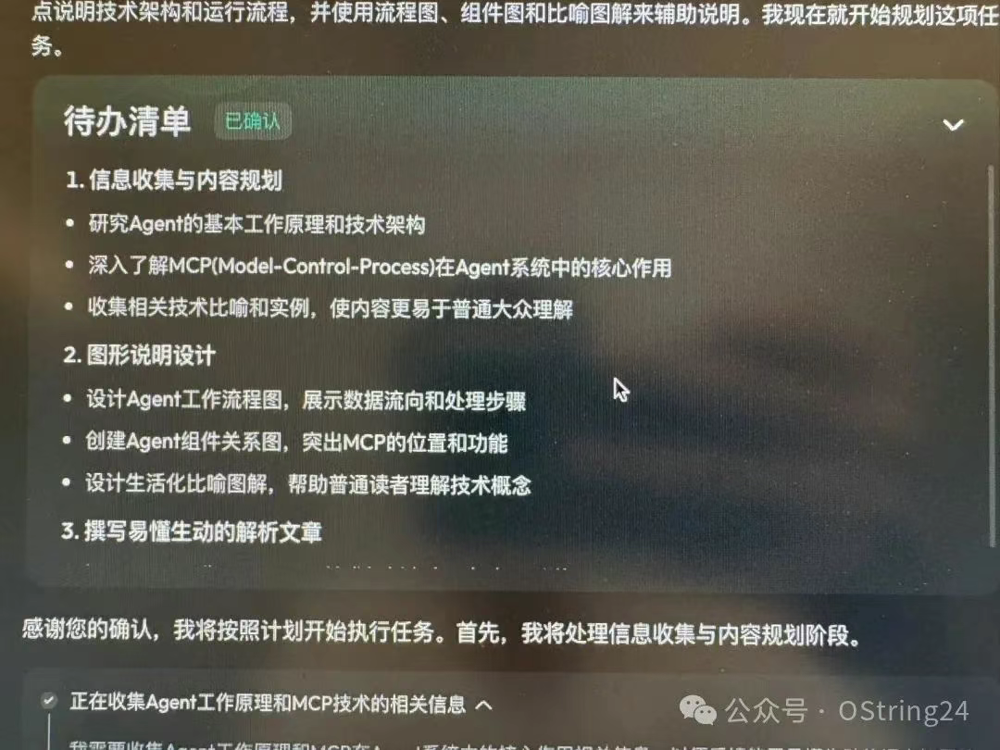

image.png

# AI 幻觉
Agent最近势头正兴，但似乎所有人已经把model 当成一个可靠的Agent/助手来使用，最终呈现效果挺惊艳，惊艳的外表下，很少看到其生成内容准确性的评估，人类都是视觉动物，更关注HTML/CSS的视觉效果。最近试用了fellou/扣子空间/manus/flowith /skywork这些市面上流行的智能体（朋友给力，第一时间给到码），这里不谈使用体验，只从大面上看Task执行过程，以及最终生成效果。总体上这些通用智能体执行成功率都不算高，中间可能有AI幻觉觉的原因。成功的结果看，视觉设计都足以打动人心，超出预期，执行过程的任务拆解和分配都符合预期，这个过程可以认为是AI 幻觉得到抑制。最终生成的内容看，基本通过web检索得到了对齐。这种担忧其实不光是我本人，

>谷歌DeepMind首席执行官德米斯·哈萨比斯（Demis Hassabis）本周称，当前AI模型存在太多“漏洞”，连明显问题都会答错。例如，本月初，一位代表Anthropic的律师在法庭文件中使用Claude生成引用文献时，AI因“幻觉”编造内容，迫使该律师当庭道歉。p所以AI 幻觉是否还是通用智能AGI，更具体一点，眼下通用智能体的障碍。

# 人类幻觉其实超出AI幻觉

最近Claude 发布了opus4和sonet4旗舰模型，Anthropic首席执行官达里奥·阿莫代伊（Dario Amodei）在公司首届开发者活动“Code with Claude”的新闻发布会上称：如今的AI模型“幻觉”（即编造内容并当作真实信息呈现）的发生率低于人类。他认为，AI幻觉并非Anthropic实现AGI（人类水平或更强的人工智能）之路上的限制。

>“这取决于测量方式，但我怀疑AI模型的幻觉频率可能比人类低，只是它们产生幻觉的方式更出人意料。”Authropic作为行业内对AGI最乐观的领导者之一，他去年在一篇广泛传播的论文中预测AGI可能最早于2026年到来，并在发布会上表示正看到相关进展“全面推进”，认为AI发展“没有明显障碍”。

# Agent 实验
目前难以验证Amodei的说法，主要原因是大多数幻觉基准测试是让AI模型相互竞争（交叉验证），而非将模型与人类进行对比。不过，目前的检索增强技术似乎有助于降低幻觉发生率，比如让AI模型能够访问网页搜索功能。另外，像OpenAI的GPT - 4.5等一些AI模型，在基准测试中的幻觉率明显低于早期系统。在Agent这类应用中，出现幻觉其实是致命的，个人猜测agent执行流成功率不高就是这个原因，比如使用skywork下发一段prompt：Agent工作原理和技术解析。中间执行还挺顺利，包括和用户的交互。但是呢，之后直接撂挑子不干了，llm 报错：手动摊手🤷
最后目前的处理AI幻觉的方法总感觉治标不治本，如果单次对话，这类幻觉确实如Anthropic CEO所说，幻觉在可控范围，但是如果需要做到Agent 通用智能体，MCP之间的token 指令准确度的要求又上升一个台阶。目前我的做法Agent 用LLM一般都在最后一个环节做summary，其他环节尽可能AI生成代码，使用代码处理，保证中间结果准确，同时最后问题定位也方便。否则面对智能体的报错，毫无办法。

# 最后
目前的处理AI幻觉的方法总感觉治标不治本，如果单次对话，这类幻觉确实如Anthropic CEO所说，幻觉在可控范围，但是如果需要做到Agent 通用智能体，MCP之间的token 指令准确度的要求又上升一个台阶。目前我的做法Agent 用LLM一般都在最后一个环节做summary，其他环节尽可能AI生成代码，使用代码处理，保证中间结果准确，同时最后问题定位也方便。否则面对智能体的报错，毫无办法。