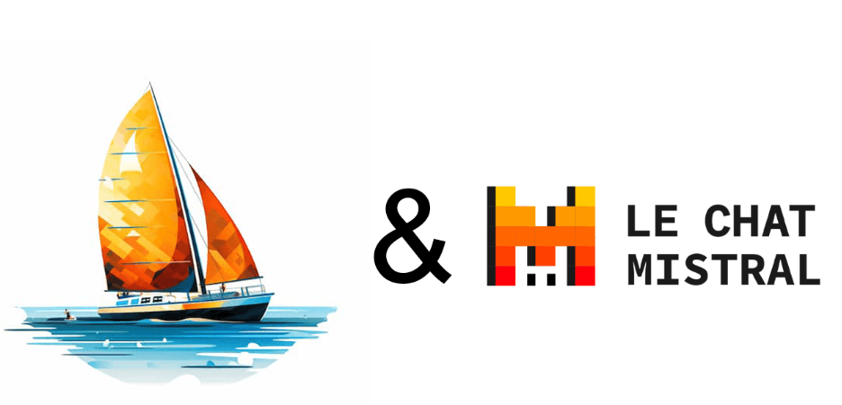

# **快被遗忘的Mistral AI 的最新动向跟踪**

Mistral AI 自 2023 年创立以来，已筹集了大量资金，其雄心壮志是“将前沿 AI 掌握在每个人手中”。虽然这并非直接针对 OpenAI，但该口号旨在强调该公司对 AI 开放性的倡导。最近Mistral AI 似乎淡出了视野，没有太多动静。

最初Mistral AI 出圈是因为其开源并支持MOE模型的创新，最近重新follow 了一下该公司的动向。

其 ChatGPT 的替代品，聊天助手 Le Chat，现在也已[在 iOS 和 Android 上提供](https://techcrunch.com/2025/02/06/mistral-releases-its-ai-assistant-on-ios-and-android/)。在移动版本发布后的两周内，它达到了 [100 万次下载](https://techcrunch.com/2025/02/19/mistrals-le-chat-tops-1m-downloads-in-just-14-days/)，甚至在 iOS App Store 上占据了法国免费下载榜首。

除此之外，Mistral AI 还提供了一系列模型，其中包括：

- [Mistral Large 2](https://techcrunch.com/2024/07/24/mistral-releases-large-2-meta-openai-ai-models/)，主要的语言大模型，取代了 [Mistral](https://techcrunch.com/2024/02/26/mistral-ai-releases-new-model-to-rival-gpt-4-and-its-own-chat-assistant/) [Large](https://techcrunch.com/2024/02/26/mistral-ai-releases-new-model-to-rival-gpt-4-and-its-own-chat-assistant/)。
- [Pixtral Large](https://mistral.ai/en/news/pixtral-large)，[于 2024 年推出](https://techcrunch.com/2024/11/18/mistral-unveils-new-ai-models-and-chat-features/)，是 [Pixtral 系列](https://techcrunch.com/2024/09/11/mistral-releases-pixtral-its-first-multimodal-model/) [多模态模型](https://techcrunch.com/2024/09/11/mistral-releases-pixtral-its-first-multimodal-model/)的新成员。
- [Mistral Medium 3](https://techcrunch.com/2025/05/07/mistral-claims-its-newest-ai-model-delivers-leading-performance-for-the-price/)，于 2025 年 5 月发布，承诺在不牺牲性能的情况下提供效率，最适合编码和 STEM 任务。
- [Devstral](https://techcrunch.com/2025/05/21/mistrals-new-devstral-model-was-designed-for-coding/)，一种专为编码设计的 AI 模型，并以 Apache 2.0 许可证公开提供，这意味着可以不受限制地用于商业用途。
- [Codestral](https://techcrunch.com/2024/05/29/mistral-releases-its-first-generative-ai-model-for-code/)，一种早期的代码生成 AI 模型，但其许可证禁止商业应用。
- “Les Ministraux”，一系列[针对手机等边缘设备优化的](https://techcrunch.com/2024/10/16/mistral-releases-new-ai-models-optimized-for-edge-devices/)模型。
- Mistral Saba，[专注于阿拉伯语](https://techcrunch.com/2025/02/17/mistral-releases-regional-model-focused-on-arabic-language-and-culture/)。

2025 年 3 月，该公司[推出了 Mistral OCR](https://techcrunch.com/2025/03/06/mistrals-new-ocr-api-turns-any-pdf-document-into-an-ai-ready-markdown-file/)，这是一种光学字符识别 (OCR) API，可以将任何 PDF 转换为文本文件，以便 AI 模型更易于提取信息。

# **Mistral AI 的创始人是谁？**

Mistral AI 的三位创始人均有在巴黎设有重要业务的美国大型科技公司从事人工智能研究的背景。首席执行官 Arthur Mensch 曾在谷歌的 DeepMind 工作，而首席技术官 Timothée Lacroix 和首席科学家 Guillaume Lample 则是 Meta 的前员工。

联合创始人顾问还包括 [Jean-Charles Samuelian-Werve](https://techcrunch.com/2025/01/27/alans-founder-role-in-mistrals-origin-story/)（也是董事会成员）和来自健康保险初创公司 Alan 的 Charles Gorintin，以及前数字部长 Cédric O，后者因其之前的职位[引发争议](https://sifted.eu/articles/french-tech-pantouflage)。

# **Mistral AI 的模型是开源的吗？**

[并非全部](https://docs.mistral.ai/getting-started/models/models_overview/)。 Mistral AI 将其顶级模型（其[权重](https://duohub.ai/glossary/w/weights)不适用于商业用途）与其免费模型区分开来，后者根据 Apache 2.0 许可证提供权重访问权限。

免费模型包括研究模型，例如 Mistral NeMo，该模型是与 Nvidia 合作构建的，初创公司于 2024 年 7 月将其[开源](https://mistral.ai/en/news/mistral-nemo)。

## **Mistral AI 如何赚钱？**

虽然 Mistral AI 的许多产品都是免费的或[现在有免费层级](https://techcrunch.com/2024/09/17/mistral-launches-a-free-tier-for-developers-to-test-its-ai-models/)，但 Mistral AI 计划从 Le Chat 的付费层级中获得一些收入。 Le Chat 的 Pro 计划于 2025 年 2 月推出，定价为每月 14.99 美元。

在纯粹的 B2B 方面，Mistral AI 通过基于使用量的定价的 API 将其顶级模型货币化。 企业还可以许可这些模型，并且该公司可能还从其战略合作伙伴关系中获得很大一部分收入，其中一些合作伙伴关系在[巴黎](https://techcrunch.com/2025/02/10/mistral-gets-down-to-business/) [AI 峰会](https://techcrunch.com/2025/02/10/mistral-gets-down-to-business/)期间重点介绍过。

然而，据多个消息来源称，总体而言，Mistral AI 的收入据报道仍处于八位数范围。

## **Mistral AI 达成了哪些合作关系？**

2024 年，Mistral AI 与 Microsoft 达成协议，其中包括通过 Microsoft 的 Azure 平台分发其 AI 模型的战略合作伙伴关系以及 1500 万欧元的投资。 英国竞争与市场管理局 (CMA) [迅速得出结论](https://techcrunch.com/2024/05/17/microsoft-dodges-uk-antitrust-scrutiny-over-its-mistral-ai-stake/)，由于其规模较小，该交易不符合调查资格。 然而，它也引发了欧盟的一些[批评](https://www.euronews.com/next/2024/02/27/furious-critics-question-microsofts-deal-with-mistral-ai-as-eu-set-to-look-into-it)。

2025 年 1 月，Mistral AI [与法新社签署了一项协议](https://techcrunch.com/2025/01/16/mistral-signs-deal-with-afp-to-offer-up-to-date-answers-in-le-chat/)，允许 Chat 查询法新社自 1983 年以来的整个文本档案。

Mistral AI 还与法国[军队](https://www.numerama.com/tech/1887772-mistral-ai-devient-un-nouvel-atout-technologique-pour-larmee-francaise.html)和[就业](https://www.euronews.com/next/2025/02/05/frances-ai-darling-mistral-and-government-jobseeker-agency-join-forces-for-ai-tools) [机构](https://www.euronews.com/next/2025/02/05/frances-ai-darling-mistral-and-government-jobseeker-agency-join-forces-for-ai-tools)、[航运巨头 CMA](https://www.cmacgm-group.com/en/news-media/cma-cgm-group-adopts-custom-designed-ai-solutions-mistral-ai)、德国国防科技初创公司 [Helsing](https://helsing.ai/newsroom/helsing-and-mistral-announce-strategic-partnership-in-defence-ai)、[IBM](https://www.ibm.com/new/announcements/ibm-launches-mistral-ai)、[Orange](https://newsroom.orange.com/orange-and-mistral-ai-join-forces-to-accelerate-artificial-intelligence-development-in-europe/) 和 [Stellantis](https://www.stellantis.com/en/news/press-releases/2025/february/stellantis-and-mistral-ai-strengthen-strategic-partnership-to-enhance-customer-experience-vehicle-development-and-manufacturing) 达成了战略合作伙伴关系。

2025 年 5 月，Mistral AI 宣布将参与在[巴黎地区创建一个 AI 园区](https://www.linkedin.com/posts/mistralai_proud-to-announce-the-creation-of-europe-activity-7330199133997133825-YVhW/)，作为与阿联酋投资公司 MGX、NVIDIA 和法国国有投资银行 [Bpifrance](https://techcrunch.com/2025/02/07/bpifrance-to-invest-10b-in-french-ai-ecosystem-by-2029/) 的合资企业的一部分。

# **截至目前，Mistral AI 筹集了多少资金？**

截至 2025 年 2 月，Mistral AI 迄今已筹集约 10 亿欧元资金，按当前汇率计算约为 10.4 亿美元。这包括一些债务融资，以及紧锣密鼓地完成的几轮股权融资。

早在 2023 年 6 月，甚至在其发布首个模型之前，Mistral AI 就完成了由 Lightspeed Venture Partners 领投的[破纪录的 1.12 亿美元种子轮融资](https://techcrunch.com/2023/06/13/frances-mistral-ai-blows-in-with-a-113m-seed-round-at-a-260m-valuation-to-take-on-openai/)。当时的消息来源称，这轮种子轮融资——[欧洲有史以来规模最大的一轮](https://www.ft.com/content/cf939ea4-d96c-4908-896a-48a74381f251)——对这家成立仅一个月的初创公司的估值为 2.6 亿美元。

参与本轮种子轮融资的其他投资者包括 Bpifrance、Eric Schmidt、Exor Ventures、First Minute Capital、Headline、JCDecaux Holding、La Famiglia、LocalGlobe、Motier Ventures、Rodolphe Saadé、Sofina 和 Xavier Niel。

仅六个月后，该公司完成了 [3.85 亿欧元的 A 轮融资](https://techcrunch.com/2023/12/11/mistral-ai-a-paris-based-openai-rival-closed-its-415-million-funding-round/)（当时约为 4.15 亿美元），据报道估值为 20 亿美元。该轮融资由 Andreessen Horowitz (a16z) 领投，现有支持者 Lightspeed 以及 BNP Paribas、CMA-CGM、Conviction、Elad Gil、General Catalyst 和 Salesforce 也参与其中。

微软在 2024 年 2 月宣布与 Mistral AI 建立合作关系，并对其进行了 [1630 万美元的可转换投资](https://techcrunch.com/2024/02/27/microsoft-made-a-16-million-investment-in-mistral-ai/)，这被视为 A 轮融资的延伸，意味着估值保持不变。

2024 年 6 月，Mistral AI 又筹集了 [6 亿欧元的股权和](https://techcrunch.com/2024/06/11/paris-based-ai-startup-mistral-ai-raises-640-million/) [债务](https://techcrunch.com/2024/06/11/paris-based-ai-startup-mistral-ai-raises-640-million/)（按当时汇率计算约为 6.4 亿美元）。这轮[早有传闻](https://techcrunch.com/2024/05/09/sources-mistral-ai-raising-at-a-6b-valuation-softbank-not-in-but-dst-is/)的融资由 General Catalyst 领投，估值为 60 亿美元，包括思科、IBM、英伟达、三星 Venture Investment Corporation 等知名投资者参与。
# **Mistral AI 的退出之路会是怎样？**

Mensch 在 2025 年 1 月的达沃斯世界经济论坛上表示，[Mistral "不待售，"](https://techcrunch.com/2025/01/21/mistral-ai-plans-ipo/) “当然，[首次公开募股]是计划。”

考虑到这家初创公司迄今为止的融资规模，这是有道理的：即使是大规模出售，也可能无法为其投资者提供足够高的回报倍数，更不用说取决于收购方的所有权问题。

然而，彻底消除挥之不去的收购传言的唯一方法，是将收入规模扩大到能够勉强证明其近 60 亿美元估值的水平。无论如何，我们后续会持续追踪。

