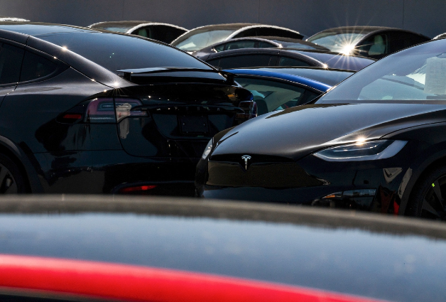

# Tesla Robotaxi上路: 实际乘坐体验

Tesla在2025年6月22日这个星期天，终于在德克萨斯州奥斯汀推出了它长期承诺的Robotaxi服务，这标志着公司进入了一个充满挑战的新时代。服务一开始就非常有限，只对一小部分受邀用户开放，这些人大多是特斯拉的忠实支持者或社交媒体影响者，他们通过一个专门的Tesla应用来召唤车辆。这些早期用户被邀请下载应用，并在奥斯汀的特定地理围栏区域内体验服务，区域覆盖了城市南部和东南部的一小块地方，但不包括机场。服务时间从早上6点到午夜，但如果遇到恶劣天气，比如大雨或强风，车辆可能会暂停运行，以确保安全。

车辆使用的是2025款Model Y SUV，外观和普通消费者版本几乎一样，但内部搭载了更先进的软件系统，这是Tesla所谓的“无监督”版Full Self-Driving技术，旨在实现完全自动驾驶。有趣的是，每辆车的前排乘客座位上都坐着一名Tesla员工，作为“安全监控员”，他们不能直接控制方向盘或刹车，但可以在紧急情况下介入或联系远程支持团队。费用是固定的4.20美元，这个数字似乎是Elon Musk对《银河系漫游指南》的致敬，因为书中“42”是生命意义的答案。一些受邀用户在社交媒体上分享了他们的体验视频，显示车辆在停车、避让行人等任务上表现平稳，但也有人报告说，在行驶中车辆突然刹车，可能与路过警车有关，这引发了外界对技术可靠性的疑问。

这次推出是Elon Musk近十年承诺的兑现，他早在2016年就暗示Tesla车辆能变成自动驾驶出租车，并在2019年预言2020年会有100万辆上路，但都未能实现。现在，投资者们将Robotaxi视为Tesla的救命稻草，因为公司近期全球销售下滑，部分原因是Musk的政治活动——他支持前总统特朗普和右翼事业，疏远了自由派买家。Tesla的市值高达1万亿美元，很大程度上依赖于Musk的AI和自动驾驶愿景，但分析师们警告说，这次有限推出远未达到预期，也落后于竞争对手。例如，Waymo已经在奥斯汀运营商业服务，与Uber合作，而Zoox、Volkswagen和Avride等公司也在当地测试自动驾驶车辆，它们使用激光雷达和雷达等多传感器系统，而Tesla只依赖摄像头，这被专家批评为在低光条件下可能出问题。

服务推出前就面临多重挑战。联邦公路交通安全管理局（NHTSA）正在调查Tesla技术是否在雾、灰尘或强光下容易失效，并已要求公司提供详细运营计划。在德克萨斯州，尽管当地法规对自动驾驶车辆较宽松，但七名民主党州议员曾写信要求推迟推出，以等待新安全法规生效。公众反应也复杂，奥斯汀居民中有人抗议，担心自动驾驶车辆会“接管”城市街道，影响安全；同时，Tesla试图通过封锁公共记录请求来保密细节，比如拒绝向德州交通部披露信息，这增加了透明度担忧。

未来，Tesla计划扩大服务，Musk说几个月内车辆数会从初始的10-20辆增加到上千辆，并最终推出名为Cybercab的专用车辆，它没有方向盘或踏板，专为出租车设计。更宏大的愿景是让现有Tesla车主将车辆升级为自动驾驶出租车，在空闲时赚取收入，但分析师质疑这个想法的可行性，因为人们可能不愿分享私人车辆。Tesla还面临内部压力，比如承诺在6月底前推出更实惠的新车型，但原型车尚未亮相，订单也未开放。

总的来说，这次Robotaxi推出是Tesla的关键一步，但它暴露了技术、监管和公众信任的短板。如果成功，它可能重塑交通行业；如果失败，则会加剧公司困境，毕竟竞争对手们已在全美多个城市稳步推进类似服务。